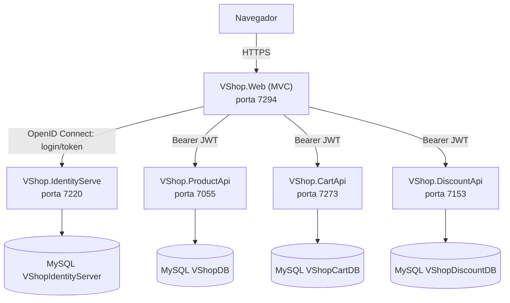

# VShop

Projeto de estudo de **arquitetura de microsserviços em .NET 8**, simulando uma loja virtual de material escolar (cadernos, lápis, clipes, etc). É composto por quatro APIs independentes e uma aplicação Web (MVC) que funciona como vitrine, carrinho e área administrativa, com login centralizado via **Duende IdentityServer** (OpenID Connect).

## Sumário

- [Visão geral da arquitetura](#visão-geral-da-arquitetura)
- [Serviços](#serviços)
- [Tecnologias](#tecnologias)
- [Estrutura do repositório](#estrutura-do-repositório)
- [Funcionalidades](#funcionalidades)
- [Modelo de dados (resumo)](#modelo-de-dados-resumo)
- [Pré-requisitos](#pré-requisitos)
- [Como executar localmente](#como-executar-localmente)
- [Usuários de teste](#usuários-de-teste)
- [Cupons de desconto (seed)](#cupons-de-desconto-seed)
- [Endpoints principais](#endpoints-principais)
- [Autenticação e autorização](#autenticação-e-autorização)
- [Observações e limitações conhecidas](#observações-e-limitações-conhecidas)
- [Licença](#licença)

## Visão geral da arquitetura



Não existe um API Gateway: o `VShop.Web` conhece o endereço de cada microsserviço (seção `ServiceUri` do `appsettings.json`) e conversa com cada um diretamente através de `HttpClient`s nomeados. O `VShop.Web` também atua como **orquestrador**: por exemplo, ao exibir o carrinho ele busca os itens na `CartApi`, busca o percentual do cupom aplicado na `DiscountApi` e calcula o total localmente antes de renderizar a tela.

## Serviços

| Serviço | Descrição | Porta HTTPS | Porta HTTP | Banco de dados |
|---|---|---|---|---|
| `VShop.Web` | Aplicação MVC — vitrine, carrinho, checkout e administração de produtos | 7294 | 5262 | — |
| `VShop.IdentityServe` | Servidor de identidade (Duende IdentityServer + ASP.NET Core Identity) | 7220 | 5207 | `VShopIdentityServer` |
| `VShop.ProductApi` | CRUD de produtos e categorias | 7055 | 5267 | `VShopDB` |
| `VShop.CartApi` | Carrinho de compras e checkout | 7273 | 5247 | `VShopCartDB` |
| `VShop.DiscountApi` | Cupons de desconto | 7153 | 5092 | `VShopDiscountDB` |

## Tecnologias

- **.NET 8** / ASP.NET Core (MVC + Web API)
- **Duende IdentityServer 7** + **ASP.NET Core Identity** — autenticação/autorização via OpenID Connect (Authorization Code Flow) e emissão de tokens JWT
- **Entity Framework Core 8** com **Pomelo.EntityFrameworkCore.MySql** — persistência em MySQL
- **AutoMapper** — mapeamento entidade ↔ DTO
- **Swagger / Swashbuckle** — documentação e teste interativo de cada API
- **Bootstrap 5**, **Font Awesome** e a fonte **Inter** (Google Fonts) no front-end

## Estrutura do repositório

```
VShop/
├── VShop.Web/            # MVC — vitrine, carrinho, checkout e admin de produtos
├── VShop.IdentityServe/  # Servidor de identidade (OIDC) — login, usuários, roles
├── VShop.ProductApi/     # API de produtos e categorias
├── VShop.CartApi/        # API de carrinho de compras e checkout
├── VShop.DiscountApi/    # API de cupons de desconto
└── VShop.sln
```

Cada projeto de API segue a mesma organização interna: `Controllers/`, `DTOs/` (+ `Mappings/` do AutoMapper), `Models/`, `Repositories/` (ou `Services/`, no caso do ProductApi), `Context/` (o `DbContext`) e `Migrations/`.

## Funcionalidades

**Loja (qualquer usuário autenticado)**
- Catálogo de produtos com página de detalhes e escolha de quantidade
- Login/logout via IdentityServer (OpenID Connect)
- Adicionar e remover itens do carrinho
- Aplicar e remover cupom de desconto
- Fluxo de checkout (dados de endereço/cartão fictícios) com página de confirmação do pedido

**Administração (role `Admin`)**
- CRUD completo de produtos em `/Products` (listar, criar, editar, excluir)
- O menu "Management" só aparece para usuários com a role `Admin`

## Modelo de dados (resumo)

| Entidade | Onde vive | Campos principais |
|---|---|---|
| `Product` | ProductApi | `Id`, `Name`, `Price`, `Description`, `Stock`, `ImageURL`, `CategoryId` |
| `Category` | ProductApi | `CategoryId`, `Name` |
| `CartHeader` | CartApi | `Id`, `UserId`, `CouponCode` |
| `CartItem` | CartApi | `Id`, `Quantity`, `ProductId`, `CartHeaderId`, `Product` (cópia local do produto) |
| `Coupon` | DiscountApi | `CouponId`, `CouponCode`, `Discount` |

> A `CartApi` mantém sua própria cópia da tabela `Products` (populada sob demanda quando um item é adicionado ao carrinho) — ela não consulta a `ProductApi` em tempo real.

## Pré-requisitos

- [.NET 8 SDK](https://dotnet.microsoft.com/download/dotnet/8.0)
- MySQL Server 8 (ou compatível) rodando em `localhost:3306`
- Ferramenta `dotnet-ef` para aplicar as migrations:
  ```
  dotnet tool install --global dotnet-ef
  ```

## Como executar localmente

1. **Clone o repositório** e abra `VShop.sln`.

2. **Configure a connection string de cada API.** O arquivo `appsettings.Development.json` é ignorado pelo Git (não vem no repositório), então crie um em cada um dos quatro projetos de back-end. Exemplo para `VShop.CartApi/appsettings.Development.json`:
   ```json
   {
     "ConnectionStrings": {
       "DefaultConnection": "Server=localhost;Port=3306;Database=VShopCartDB;Uid=root;Pwd=SUA_SENHA;"
     }
   }
   ```
   Repita para os outros três, trocando apenas o nome do banco:
   - `VShop.ProductApi` → `VShopDB`
   - `VShop.DiscountApi` → `VShopDiscountDB`
   - `VShop.IdentityServe` → `VShopIdentityServer`

   (`VShop.ProductApi` e `VShop.DiscountApi` também leem `Vshop.IdentityServer:ApplicationUrl`, mas isso já vem definido em `appsettings.json` apontando para `https://localhost:7220`.)

3. **Aplique as migrations** (cria o banco e as tabelas de cada serviço):
   ```
   dotnet ef database update --project VShop.IdentityServe
   dotnet ef database update --project VShop.ProductApi
   dotnet ef database update --project VShop.CartApi
   dotnet ef database update --project VShop.DiscountApi
   ```
   A `ProductApi` já popula 3 produtos (Caderno, Lápis, Clips) e a `DiscountApi` popula 2 cupons — ver seções abaixo. A `IdentityServe` cria as roles e os usuários de teste automaticamente na primeira execução (não é uma migration, acontece no startup).

4. **Suba os serviços**, preferencialmente nessa ordem — o IdentityServer precisa estar de pé antes dos demais, pois eles validam o token JWT contra ele:
   ```
   dotnet run --project VShop.IdentityServe
   dotnet run --project VShop.ProductApi
   dotnet run --project VShop.CartApi
   dotnet run --project VShop.DiscountApi
   dotnet run --project VShop.Web
   ```
   Cada API expõe o Swagger em `/swagger` (ex.: `https://localhost:7055/swagger`), útil para testar os endpoints isoladamente com um token Bearer.

5. **Acesse** `https://localhost:7294` para abrir o `VShop.Web`.

## Usuários de teste

Criados automaticamente pelo `DatabaseIdentityServerInitializer` no primeiro start da `IdentityServe`:

| Usuário | E-mail | Senha | Role |
|---|---|---|---|
| admin1 | admin1@com.br | `Numsey#2022` | Admin |
| client1 | client1@com.br | `Numsey#2022` | Client |

Apenas a role `Admin` enxerga o menu "Management" (CRUD de produtos).

## Cupons de desconto (seed)

| Código | Desconto |
|---|---|
| `VSHOP_PROMO_10` | 10% |
| `VSHOP_PROMO_20` | 20% |

## Endpoints principais

### ProductApi — `/api/Products`

| Método | Rota | Autorização | Descrição |
|---|---|---|---|
| GET | `/api/Products` | livre | Lista todos os produtos |
| GET | `/api/Products/{id}` | livre | Busca um produto por id |
| POST | `/api/Products` | role `Admin` | Cria um produto |
| PUT | `/api/Products` | role `Admin` | Atualiza um produto |
| DELETE | `/api/Products/{id}` | role `Admin` | Remove um produto |

### ProductApi — `/api/Categories`

| Método | Rota | Autorização | Descrição |
|---|---|---|---|
| GET | `/api/Categories` | usuário autenticado | Lista categorias |
| GET | `/api/Categories/{id}` | usuário autenticado | Busca categoria por id |
| GET | `/api/Categories/products` | usuário autenticado | Lista categorias com seus produtos |
| POST | `/api/Categories` | usuário autenticado | Cria categoria |
| PUT | `/api/Categories/{id}` | usuário autenticado | Atualiza categoria |
| DELETE | `/api/Categories/{id}` | role `Admin` | Remove categoria |

### CartApi — `/api/Cart`

| Método | Rota | Autorização | Descrição |
|---|---|---|---|
| GET | `/api/Cart/getcart/{userId}` | livre* | Retorna o carrinho do usuário |
| POST | `/api/Cart/addcart` | livre* | Adiciona um item (cria o carrinho se não existir) |
| PUT | `/api/Cart/updatecart` | livre* | Atualiza/mescla itens do carrinho |
| DELETE | `/api/Cart/deletecart/{id}` | livre* | Remove um item do carrinho |
| POST | `/api/Cart/applycoupon` | livre* | Grava o código do cupom no cabeçalho do carrinho |
| DELETE | `/api/Cart/deletecoupon/{userId}` | livre* | Remove o cupom do carrinho |
| POST | `/api/Cart/checkout` | livre* | Monta o `CheckoutHeaderDTO` com os itens e a data/hora do pedido |

\* A `CartApi` tem autenticação JWT configurada no `Program.cs`, mas nenhuma rota do `CartController` está marcada com `[Authorize]` — hoje esses endpoints respondem sem exigir token. Ver [Observações](#observações-e-limitações-conhecidas).

### DiscountApi — `/api/Coupon`

| Método | Rota | Autorização | Descrição |
|---|---|---|---|
| GET | `/api/Coupon/{couponCode}` | usuário autenticado | Busca um cupom pelo código |

## Autenticação e autorização

- O `VShop.Web` usa dois esquemas de autenticação: um cookie (`Cookies`) para a sessão do navegador e `oidc` (OpenID Connect, Authorization Code Flow) para o login contra a `IdentityServe`. O client registrado é `vshop` (client secret `abracadabra#simsalabim`, definido em `IdentityConfiguration.cs` — apenas para desenvolvimento).
- Após o login, o `access_token` (JWT) é armazenado na sessão do usuário e reenviado em cada chamada às APIs.
- `ProductApi` e `DiscountApi` validam o token Bearer contra a autoridade `https://localhost:7220` e exigem o escopo `vshop`; algumas rotas administrativas (criação/edição/exclusão de produtos e categorias) também exigem a role `Admin`.
- As roles (`Admin` e `Client`) e os usuários de teste são semeados pelo `DatabaseIdentityServerInitializer` no startup da `IdentityServe`.

## Observações e limitações conhecidas

- **Sem API Gateway**: o front-end aponta diretamente para cada microsserviço via configuração (`ServiceUri` em `VShop.Web/appsettings*.json`).
- **`CartApi` sem `[Authorize]`**: apesar do JWT Bearer estar configurado, nenhuma ação do `CartController` está protegida — qualquer requisição sem token consegue ler/alterar o carrinho de qualquer `userId`.
- **Cupom não é validado pela `CartApi`**: quem consulta o percentual de desconto na `DiscountApi` e recalcula o total é o `VShop.Web`; a `CartApi` apenas grava o código do cupom recebido, sem checar se ele existe.
- **Segredos em texto puro**: client secret do OIDC e credenciais de banco ficam em arquivos de configuração locais — aceitável para um projeto de estudo, não para produção.
- **Sem testes automatizados** e sem pipeline de CI configurado no repositório.

## Licença

O código deste repositório está sob a licença [MIT](LICENSE) — sinta-se livre para estudar, clonar e reaproveitar.

Isso não se estende às dependências de terceiros, que mantêm suas próprias licenças. Em especial, o **Duende IdentityServer** é distribuído sob a Reciprocal Public License (RPL 1.5): o uso é gratuito para desenvolvimento, testes, projetos pessoais/educacionais e empresas abaixo de um teto de faturamento anual definido pela Duende, mas uso comercial em produção acima desse teto exige licença paga. Este projeto é de estudo e se enquadra no uso gratuito — se for reaproveitar a base para algo comercial, confira os termos atuais em [duendesoftware.com](https://duendesoftware.com/products/identityserver).
